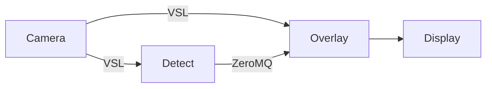

# VisionPack IPC Example

This project demonstrates an inter-process AI solution using VideoStream Library for sharing frames between applications and mixing DeepViewRT AI inferencing using VAAL and traditional vision processing using OpenCV.

This diagram shows the VSL flow from the camera to the AI application (detect), which detects faces and publishes the bounding boxes over a ZeroMQ socket.  The same camera stream is accessed through VSL from the second OpenCV-based application (overlay), which performs a blur operation over the bounding boxes captured through the ZeroMQ socket. The results are shown on-screen.



## Design

The design of this application is primarily for illustrative purposes to show how to use VideoStream Library to share DMA-enabled camera frames between multiple applications, implement a minimal VisionPack application with camera input and publishing results to a message queue, and basic OpenCV support for the VideoStream Library buffers.

We use JSON for the message queue data. This could easily be changed to a binary representation such as CDR, BSON, or others which may be more suitable for a real-time system.  Further the ZeroMQ library for message passing could be replaced with any alternative such as native POSIX Message Queues, MQTT, NanoMsg, etc...

## Requirements

- NXP i.MX 8M Plus running Linux.
- C compiler toolchain for the target.
  - *Note the Ubuntu cross-toolchain does work with the OpenCV HighGUI module, which is used in this example.*
- VisionPack is installed into the toolchain and on the target.
- OpenCV is installed into the toolchain and on the target.
- ZeroMQ is installed into the toolchain and on the target.

### Yocto

If you're using Yocto you should follow the VisionPack for Yocto instructions to integrate VisionPack into your Yocto workflow then add the following to your conf/local.conf to install the appropriate dependencies.  This assumes you're building the imx-image-multimedia or compatible image, which provides GStreamer and OpenCV already.

```
IMAGE_INSTALL:append = "visionpack zeromq"
```

## Source

The applications and source code are organized as described in the following list.  The overlay application uses C++, as required for OpenCV.

- camera.sh - gstreamer script with vslsink
- detect - inference application with zeromq publisher
  - detect.c - main application in C
  - flex.h/c - json flexible buffer generator for C
  - writer.h/c - json output writer for C
  - stb_snprintf.h - portable snprintf implementation for json writer
  - base64.h - portable base64 implementation for json writer
- overlay - opencv overlay application with zeromq subscriber
  - overlay.cpp - main application in C++
  - zmq.hpp - zeromq bindings for C++
  - json.hpp - json parsing library for C++

## Compile

The application is built using the provided Makefile, for example from an Ubuntu Linux host (Windows Subsystem for Linux is supported). You simply need to install the VisionPack and OpenCV ARM64 libraries and type make.

*Note: currently the opencv-highgui module used to display results cannot be installed as a multi-arch package so the application must be built with ENABLE_DISPLAY=0.  Building with Yocto has no such limitation.*

```shell
make ENABLE_DISPLAY=0
```

If using a Yocto build environment, ensure meta-deepview is integrated into your toolchain and target.  Then simply source the Yocto environment and type make.

```shell
source /opt/yocto/.../environment
make
```

## Run

Once the applications are built, copy them, along with the model, to the i.MX 8M Plus target.  You will need three terminals open on the target the run the three applications.

1. GStreamer Camera with VSL Sink
   - ./camera.sh
2. VisionPack AI Application
   - ./detect mymodel.rtm
3. OpenCV Blur and Display Application
   - ./overlay